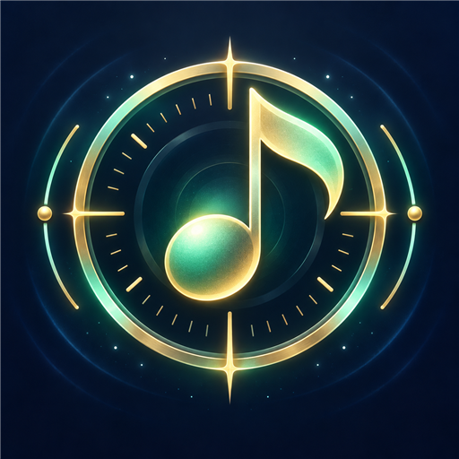
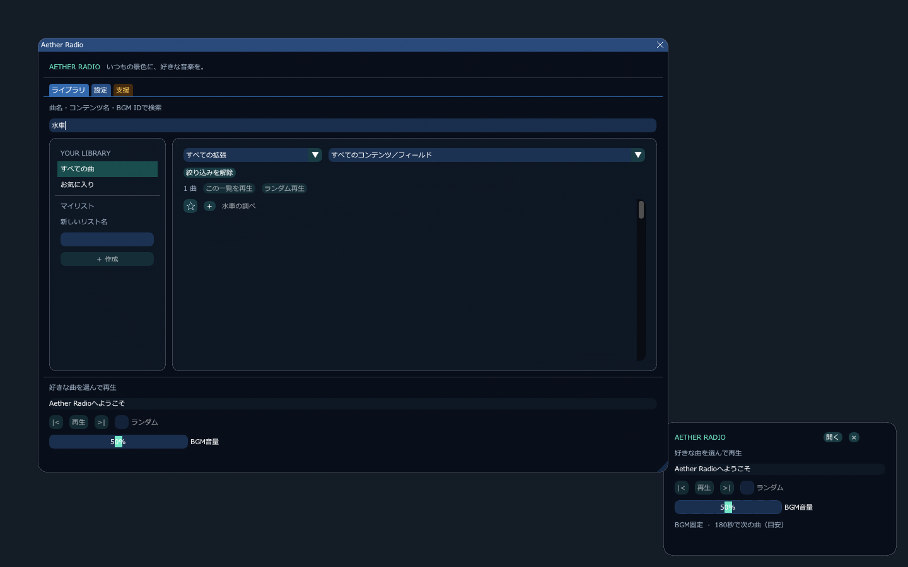

# BGMPlayer

FFXIVのBGMを選んで再生するDalamudプラグインです。作者: **Roxyz0501**。





上の画像は実装したUIの単体描画プレビューです。ゲーム内のスクリーンショットではありません。

## 機能

- 上部の拡張タブ → 討滅・レイド・ダンジョン・フィールドなどのタブ → コンテンツ名のプルダウンで絞り込み。
- 曲一覧はページ送りなしのスクロール表示。画面内の行だけを描画します。
- インストール済みBGM表の全ファイルを列挙。データ更新で増えた曲もIDで表示。
- 日本語曲名・BGM ID・場所・メタデータによる検索。
- お気に入り、複数マイリスト、名前変更、曲の追加／削除／並べ替え。
- 重複しないシャッフル、前／次、リストリピート、1曲の継続再生。
- 収録時間の目安による自動曲送り。時間不明の曲には設定秒数を使用。
- 四隅への配置、自由移動、位置固定、背景の不透明度、BGM音量。
- 再生中のBGM固定、停止時のゲームBGM復帰。設定・リストはDalamudに保存。
- 任意の「支援」タブ。支援による機能制限はありません。

旧称はAether Radioです。既存のインストールを更新するとBGMPlayerになり、マイリストや設定は引き継がれます。
旧コマンド `/aetherradio` も互換用に使用できます。

## インストール

1. `/xlsettings` の「試験的機能」からカスタムプラグインリポジトリを追加します。
2. 次のURLを登録して設定を保存します。

   `https://raw.githubusercontent.com/Roxyz0501/DalamudPluginRepo/main/repo.json`

3. `/xlplugins` で **BGMPlayer** を検索してインストールします。
4. `/bgmplayer` で曲を選びます。`/bgmplayer stop` は固定を解除します。

現在の公開版はプレビューです。ゲーム内の音声再生・固定・復帰の実機確認は未完了です。

### 開発用DLLを直接読み込む場合

1. Release ZIPを任意の専用フォルダーに展開します。
2. Dalamudの開発プラグイン設定に、展開した `AetherRadio.dll` のパスを追加します。
3. 開発プラグイン一覧からBGMPlayerを読み込みます。
4. `/bgmplayer` で曲を選びます。`/bgmplayer stop` は固定を解除します。

ミニプレイヤー上部の「BGMPlayer」をドラッグして移動できます。
「固定」で位置を固定し、「解除」で再び移動できます。位置は次回も保持します。

曲の「＋」でマイリストへ追加できます。再生ボタンは選択した一覧を再生キューとして
取り込みます。再生後のリスト編集は、次にその一覧を再生するときに反映されます。
停止はゲームBGMに戻す操作です。再生し直すと曲の先頭から始まります。
音量スライダーはプラグイン側の調整値です。ゲームの音量設定は変更せず、
再生中だけBGM音量を下げます。100%はゲーム側で設定したBGM音量です。
SE・ボイス・環境音は変更しません。停止・終了時にはBGM音量を戻します。
旧版で変更済みのゲーム設定は元の値が分からないため、自動では戻せません。

オーケストリオンが流れている場所では、BGMPlayerの再生中だけ自分に聞こえる
オーケストリオン音を抑えます。停止すると、その時点の曲が再び聞こえます。
家具側の曲・プレイリストや、他のプレイヤーに聞こえる音は変更しません。

ログアウトすると再生・BGM固定を解除し、選択中の曲・再生キュー・経過時間をリセットします。
マイリスト・お気に入り・音量・ウィンドウ位置は保持します。
次のログインでは停止状態から、曲を選んで再生できます。

## 収録範囲・検証状況

対象はインストール済みゲームの `BGM` 表にある、実在する音源です。
オーケストリオン専用音源、外部MP3、音声台詞の再生は対象外です。
コンテンツ内のすべての曲に分類用の関連データがあるわけではありません。
関連を取得できない曲は削除せず「その他」に表示します。
曲名・メタデータに明記された場所からの補助分類は、曲のツールチップで区別します。
曲名が不明な曲は「曲名未登録」と表示し、場所が分かる場合は場所名を添えます。
曲の識別番号も表示します。内部ファイル名はツールチップで確認できます。

Releaseビルドと実ゲームデータのオフライン照合、再生キューの自動テストを実施します。
ゲーム内でのネイティブ音声再生・全コンテンツでの固定・描画の実機確認は別途必要です。
確認結果は `VALIDATION.md`、公開状態は `PUBLICATION_STATE.md` に記録します。

自動曲送りの時間はメタデータによる目安で、音声エンジンの終了通知ではありません。
1曲リピートはゲーム本来のループを維持します。非ループの短い効果曲などでは
通常BGMと同じ挙動になるとは限りません。

## ローカル再生の設計

FFXIVClientStructsの `BGMSystem.SetBGM` / `ResetBGM` を介し、最優先のローカル
BGMシーンを使用します。再生中に同シーンへ来たゲーム側の要求は記録し、
固定解除時に最新の要求を戻します。他のBGMシーンは通常どおり更新されます。
パケット生成・送信、ネットワークフック、ゲームイベント送信、チャット送信は実装しません。
音源をサーバーや他プレイヤーへ送る機能はありません。
ログイン時の自動再生は行わず、ユーザーが曲を選んだときだけ開始します。

## ビルド

.NET SDK 10、Dalamud API 15の開発ライブラリが必要です。

```powershell
./tools/Build-Release.ps1 -DalamudLibPath 'D:/path/to/Dalamud/dev/'
dotnet run --project Tests -c Release -p:DalamudLibPath='D:/path/to/Dalamud/dev/'
```

実ゲームのカタログ検証には、テストコマンド末尾に `-- 'D:/path/to/game/sqpack'` を追加します。
配布ZIPは `artifacts/AetherRadio-0.1.5.0.zip` に生成されます。

## 配布

専用ソース・Issue・Releaseリポジトリ: https://github.com/Roxyz0501/AetherRadio

配布には既存の共有Dalamudリポジトリを使用します。
https://raw.githubusercontent.com/Roxyz0501/DalamudPluginRepo/main/repo.json

`release/repository-entry.template.json` は共有インデックス用メタデータのテンプレートです。
独立したカスタムリポジトリではありません。各バージョンの公開時にアイコンURL・
ソースURL・Release ZIPを検証します。

## 出典とライセンス

曲名・検索用補足情報・推定時間は、Meli / perchbirdと貢献者による
[OrchestrionPlugin](https://github.com/perchbirdd/OrchestrionPlugin) のMITデータを使用しています。
BGMシーン優先度の理解にも同プロジェクトの実装を参照しました。
独立して作成したUI・カタログ・再生制御と、これらの第三者データは区別しています。
詳細は [THIRD_PARTY_NOTICES.md](THIRD_PARTY_NOTICES.md) と `licenses/` を参照してください。

本プロジェクトのコードはMITライセンスです。
任意の開発支援: [Roxyz0501 / Ko-fi](https://ko-fi.com/roxyz0501)
